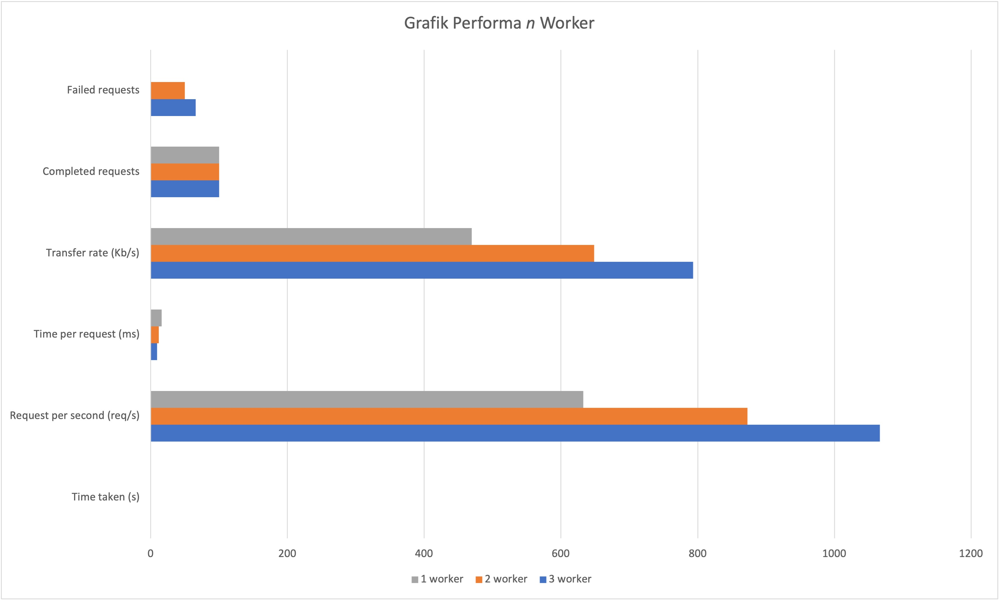
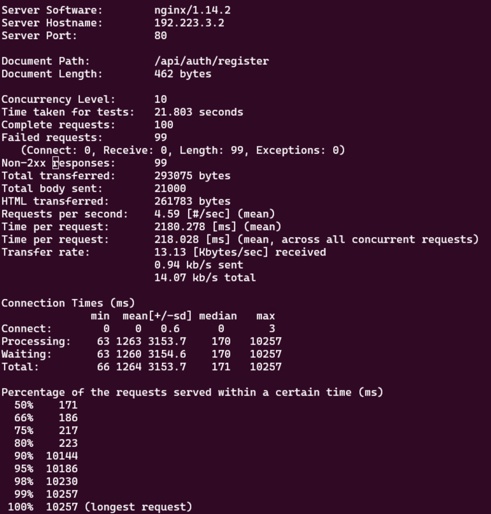
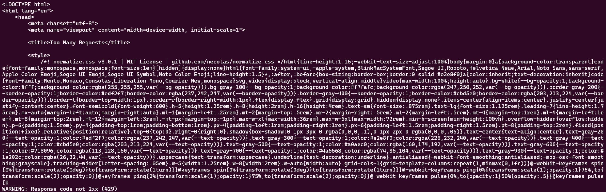

# Jarkom-Modul-3-F04-2023

## Anggota Kelompok

1. 5025211149 - Irsyad Fikriansyah Ramadhan
2. 5025211158 - Ghifari Maaliki Syafa Syuhada

| Kelompok | Prefix IP |
|----------|-----------|
| F04      | 192.223   |

## Link
Untuk grimoire dan file export dapat dilihat disini:

https://its.id/m/Prak3JarkomF04

## Cara Setup GNS dengan script
- Pertama nyalakan semua node
- Jalankan `script.sh` pada node Aura terlebih dahulu
- Lalu jalankan `script.sh` pada node Heiter dan Himmel
- Setelah itu jalankan `script.sh` pada node-node lain

## Cara Kami Mengerjakan

<div align=justify>
Cara kami mengerjakan praktikum ini adalah dengan menggunakan 1 buah file `script.sh` yang kami letakkan pada setiap node pada topologi. `script.sh` kami berisikian command command yang jika dijalankan akan men-setup node tersebut. Di dalam setiap node juga terdapat 1 buah file `install_script.sh` yang berisikan command untuk mengdownload packages yang diperlukan pada node tersebut. Pada tiap root juga terdapat file konfigurasi node yang telah dibuat sebelumnya, sehingga pada `script.sh` kami tinggal hanya men-copy file konfigurasi pada directory yang semestinya
</div>

## Topologi


### Netwok Configuration

Router:
* Aura (Router/DHCP Relay):
    ```sh
    # DHCP config for eth0
    auto eth0
    iface eth0 inet dhcp

    # Static config for eth1
    auto eth1
    iface eth1 inet static
        address 192.223.1.1
        netmask 255.255.255.0

    # Static config for eth2
    auto eth2
    iface eth2 inet static
        address 192.223.2.1
        netmask 255.255.255.0

    # Static config for eth3
    auto eth3
    iface eth3 inet static
        address 192.223.3.1
        netmask 255.255.255.0

    # Static config for eth4
    auto eth4
    iface eth4 inet static
        address 192.223.4.1
        netmask 255.255.255.0
    ```

Switch 1
* Himmel (DHCP Server):
    ```sh
    auto eth0
    iface eth0 inet static
        address 192.223.1.2
        netmask 255.255.255.0
        gateway 192.223.1.1
    ```

* Heiter (DNS Server):
    ```sh
    auto eth0
    iface eth0 inet static
        address 192.223.1.3
        netmask 255.255.255.0
        gateway 192.223.1.1
    ```

Switch2
* Denken (Database Server):
    ```sh
    auto eth0
    iface eth0 inet static
        address 192.223.2.2
        netmask 255.255.255.0
        gateway 192.223.2.1
    ```

* Eisen (Load Balancer):
    ```sh
    auto eth0
    iface eth0 inet static
        address 192.223.2.3
        netmask 255.255.255.0
        gateway 192.223.2.1
    ```

Switch3
* Revolte (Client):
    ```sh
    auto eth0
    iface eth0 inet dhcp
    ```

* Richter (Client):
    ```sh
    auto eth0
    iface eth0 inet dhcp
    ```

* Lawine (Laravel Worker):
    ```sh
    auto eth0
    iface eth0 inet dhcp
    hwaddress ether b6:01:69:0e:9d:82
    ```

* Linie (Laravel Worker):
    ```sh
    auto eth0
    iface eth0 inet dhcp
    hwaddress ether 3a:8e:11:17:0a:25
    ```

* Lugner (Laravel Worker):
    ```sh
    auto eth0
    iface eth0 inet dhcp
    hwaddress ether 0a:1f:d6:f4:b0:3f
    ```

Switch4
* Sein (Client):
    ```sh
    auto eth0
    iface eth0 inet dhcp
    ```

* Stark (Client):
    ```sh
    auto eth0
    iface eth0 inet dhcp
    ```

* Frieren (PHP Worker):
    ```sh
    auto eth0
    iface eth0 inet dhcp
    hwaddress ether 92:41:df:cb:af:16
    ```

* Flamme (PHP Worker):
    ```sh
    auto eth0
    iface eth0 inet dhcp
    hwaddress ether 2e:25:8e:a2:72:68
    ```

* Fern (PHP Worker):
    ```sh
    auto eth0
    iface eth0 inet dhcp
    hwaddress ether 2e:96:83:59:da:5b
    ```

## Setup DHCP

### Setup DHCP Relay on `Aura`

1. install `isc-dhcp-relay`
2. configure `/etc/default/isc-dhcp-relay`
3. configure `/etc/sysctl.conf`
4. run `service isc-dhcp-relay restart`

* `/etc/default/isc-dhcp-relay`:
    ```sh
    SERVERS="192.223.1.2"
    INTERFACES="eth1 eth2 eth3 eth4"
    OPTIONS=
    ```
* `/etc/sysctl.conf`:
    ```sh
    net.ipv4.ip_forward=1
    ```

### Setup DHCP Server on `Himmel`

1. install `isc-dhcp-server`
2. konfigurasi `/etc/default/isc-dhcp-server`
3. konfigurasi `/etc/dhcp/dhcpd.conf`
4. jalankan `service isc-dhcp-server restart`

* `/etc/default/isc-dhcp-server`:
    ```sh
    INTERFACESv4="eth0"
    INTERFACESv6=""
    ```

* `/etc/dhcp/dhcpd.conf`:
    ```sh
    ddns-update-style none;
    option domain-name "example.org";
    option domain-name-servers ns1.example.org, ns2.example.org;

    default-lease-time 600;
    max-lease-time 7200;

    authoritative;
    log-facility local7;

    # eth1
    subnet 192.223.1.0 netmask 255.255.255.0 {
    option routers 192.223.1.1;
    }

    # eth2
    subnet 192.223.2.0 netmask 255.255.255.0 {
    option routers 192.223.2.1;
    }

    # eth3
    subnet 192.223.3.0 netmask 255.255.255.0 {
        range 192.223.3.16 192.223.3.32;
        range 192.223.3.64 192.223.3.80;
        option routers 192.223.3.1;
        option broadcast-address 192.223.3.255;
        option domain-name-servers 192.223.1.3;
        default-lease-time 180;
        max-lease-time 5760;
    }

    # eth4
    subnet 192.223.4.0 netmask 255.255.255.0 {
        range 192.223.4.12 192.223.4.20;
        range 192.223.4.160 192.223.4.168;
        option routers 192.223.4.1;
        option broadcast-address 192.223.4.255;
        option domain-name-servers 192.223.1.3;
        default-lease-time 720;
        max-lease-time 5760;
    }

    # Switch 3
    host Lawine {
        hardware ethernet b6:01:69:0e:9d:82;
        fixed-address 192.223.3.2;
    }

    host Linie {
        hardware ethernet 3a:8e:11:17:0a:25;
        fixed-address 192.223.3.3;
    }

    host Lugner {
        hardware ethernet 0a:1f:d6:f4:b0:3f;
        fixed-address 192.223.3.4;
    }

    # Switch 4
    host Frieren {
        hardware ethernet 92:41:df:cb:af:16;
        fixed-address 192.223.4.2;
    }

    host Flamme {
        hardware ethernet 2e:25:8e:a2:72:68;
        fixed-address 192.223.4.3;
    }

    host Fern {
        hardware ethernet 2e:96:83:59:da:5b;
        fixed-address 192.223.4.4;
    }
    ```

## Soal 1

> Setelah mengalahkan Demon King, perjalanan berlanjut. Kali ini, kalian diminta untuk melakukan register domain berupa `riegel.canyon.f04.com` untuk worker Laravel dan `granz.channel.f04.com` untuk worker PHP (0) mengarah pada worker yang memiliki IP `192.223.x.1`.

<hr style="width:60%; align:center">

Pada Heiter:

1. tambakan `nameserver` pada `/etc/resolv.conf`
2. install `bind9`
3. konfigurasi `/etc/bind/named.conf.local`
4. konfigurasi `/etc/bind/named.conf.options`
5. buat directory baru `/etc/bind/granz`
6. buat directory baru `/etc/bind/riegel`
7. buat file config baru `/etc/bind/granz/granz.channel.f04.com`
8. buat file config baru `/etc/bind/riegel/riegel.canyon.f04.com`
9. jalankan `service bind9 restart` 

* `/etc/resolv.conf`:
    ```sh
    nameserver 192.168.122.1  # IP NAT1
    ```

* `/etc/bind/named.conf.local`:
    ```sh
    zone "granz.channel.f04.com" {
    type master;
    file "/etc/bind/granz/granz.channel.f04.com";
    };

    zone "riegel.canyon.f04.com" {
        type master;
        file "/etc/bind/riegel/riegel.canyon.f04.com";
    };
    ```

* `/etc/bind/named.conf.options`:
    ```sh
    options {
        directory "/var/cache/bind";
        forwarders {
                192.168.122.1;
        };
        auth-nxdomain no;    # conform to RFC1035
        listen-on-v6 { any; };
    };
    ```

* `/etc/bind/granz/granz.channel.f04.com`:
    ```sh
    ;
    ; BIND data file for local loopback interface
    ;
    $TTL    604800
    @       IN      SOA     granz.channel.f04.com. root.granz.channel.f04.com. (
                                2         ; Serial
                            604800         ; Refresh
                            86400         ; Retry
                            2419200         ; Expire
                            604800 )       ; Negative Cache TTL
    ;
    @           IN      NS      granz.channel.f04.com.
    @           IN      A       192.223.2.3 ; IP Eisen
    www         IN      CNAME   granz.channel.f04.com.
    ```

* `/etc/bind/riegel/riegel.canyon.f04.com`:
    ```sh
    ;
    ; BIND data file for local loopback interface
    ;
    $TTL    604800
    @       IN      SOA     riegel.canyon.f04.com. root.riegel.canyon.f04.com. (
                                2         ; Serial
                            604800         ; Refresh
                            86400         ; Retry
                            2419200         ; Expire
                            604800 )       ; Negative Cache TTL
    ;
    @           IN      NS      riegel.canyon.f04.com.
    @           IN      A       192.223.2.3 ; IP Eisen
    www         IN      CNAME   riegel.canyon.f04.com.
    ```

## Soal 2

> Client yang melalui Switch3 mendapatkan range IP dari 192.223.3.16 - 192.223.3.32 dan 192.223.3.64 - 192.223.3.80

<hr style="width:60%; align:center">

Pada Himmel:

1. tambahkan konfigurasi range ip pada `/etc/default/isc-dhcp-server`

* `/etc/default/isc-dhcp-server`:
    ```sh
    ...
        # eth3
        subnet 192.223.3.0 netmask 255.255.255.0 {
            range 192.223.3.16 192.223.3.32;
            range 192.223.3.64 192.223.3.80;
            option routers 192.223.3.1;
            option broadcast-address 192.223.3.255;
            option domain-name-servers 192.223.1.3;
            default-lease-time 180;
            max-lease-time 5760;
        }
    ...
    ```

## Soal 3

> Client yang melalui Switch4 mendapatkan range IP dari 192.223.4.12 - 192.223.4.20 dan 192.223.4.160 - 192.223.4.168

<hr style="width:60%; align:center">

Pada Himmel:

1. add ip range configuration in `/etc/default/isc-dhcp-server`

* `/etc/default/isc-dhcp-server`:
    ```sh
    ...
        # eth4
        subnet 192.223.4.0 netmask 255.255.255.0 {
            range 192.223.4.12 192.223.4.20;
            range 192.223.4.160 192.223.4.168;
            option routers 192.223.4.1;
            option broadcast-address 192.223.4.255;
            option domain-name-servers 192.223.1.3;
            default-lease-time 720;
            max-lease-time 5760;
        }
    ...
    ```

## Soal 4

> Client mendapatkan DNS dari Heiter dan dapat terhubung dengan internet melalui DNS tersebut

<hr style="width:60%; align:center">

Pada Himmel:

1. tambahkan konfigurasi DNS pada `/etc/default/isc-dhcp-server` di `Himmel` menuju `Heiter`

* `/etc/default/isc-dhcp-server`:
    ```sh
    ...
        subnet 192.223._.0 netmask 255.255.255.0 {
            ...
            option domain-name-servers 192.223.1.3;
            ...
        }
    ...
    ```
    
## Soal 5

> Lama waktu DHCP server meminjamkan alamat IP kepada Client yang melalui Switch3 selama 3 menit sedangkan pada client yang melalui Switch4 selama 12 menit. Dengan waktu maksimal dialokasikan untuk peminjaman alamat IP selama 96 menit

<hr style="width:60%; align:center">

Pada Himmel

1. add lease time configuration in `/etc/default/isc-dhcp-server`

* `/etc/default/isc-dhcp-server`:
    ```sh
    ...
        # eth3
        subnet 192.223.3.0 netmask 255.255.255.0 {
            ...
            default-lease-time 180;
            max-lease-time 5760;
        }

        # eth4
        subnet 192.223.4.0 netmask 255.255.255.0 {
            ...
            default-lease-time 720;
            max-lease-time 5760;
        }
    ...
    ```
    
    
## Soal 6

> Pada masing-masing worker PHP, lakukan konfigurasi virtual host untuk website berikut dengan menggunakan php 7.3.

<hr style="width:60%; align:center">

Pada tiap PHP worker:

1. install `nginx php php-fpm`
2. download file website dengan `wget` (butuh `wget` dan `unzip`)
3. buat directory baru `/var/www/granz`
4. copy file website yang telah di-unzip ke directory `/var/www/granz/`
5. hapus directory default pada nginx `/etc/nginx/sites-enabled/default`
6. buat file config baru `/etc/nginx/sites-available/granz.channel.f04`
7. link file `/etc/nginx/sites-available/granz.channel.f04` pada `/etc/nginx/sites-enabled`
8. jalankan `service nginx restart`
9. jalankan `service php7.3-fpm start`

* download dan unzip file dengan command berikut:
    ```sh
    wget --no-check-certificate "https://drive.google.com/uc?export=download&id=1ViSkRq7SmwZgdK64eRbr5Fm1EGCTPrU1" -O file
    unzip file.zip
    ```
* `/etc/nginx/sites-available/granz.channel.f04`:
    ```sh
    server {
            listen 80 default_server;
            listen [::]:80 default_server;

            root /var/www/granz;

            index index.html index.htm index.php;

            server_name granz.channel.f04.com;

            location / {
                    try_files $uri $uri/ =404;
            }

            location ~ \.php$ {
                include snippets/fastcgi-php.conf;
                fastcgi_pass unix:/run/php/php7.3-fpm.sock;
            }
    }
    ```
    
## Soal 7

> Kepala suku dari Bredt Region memberikan resource server sebagai berikut: <br>
> a. Lawine, 4GB, 2vCPU, dan 80 GB SSD. <br>
> b. Linie, 2GB, 2vCPU, dan 50 GB SSD. <br>
> c. Lugner 1GB, 1vCPU, dan 25 GB SSD. <br>
> aturlah agar Eisen dapat bekerja dengan maksimal, lalu lakukan testing dengan 1000 request dan 100 request/second.

<hr style="width:60%; align:center">

Untuk melakukan testing, kita dapat menggunakan `ApacheBench`. berikut adalah langkah-langkahnya:

Pada salah satu client:

1. install `apache2-utils`
2. jalankan `ab -n 1000 -c 100 granz.channel.f04.com/`

#### hasil:


    
## Soal 8

> Karena diminta untuk menuliskan grimoire, buatlah analisis hasil testing dengan 200 request dan 10 request/second masing-masing algoritma Load Balancer dengan ketentuan sebagai berikut: <br>
> a. Nama Algoritma Load Balancer <br>
> b. Report hasil testing pada Apache Benchmark <br>
> c. Grafik request per second untuk masing masing algoritma. <br>
> d. Analisis 
 
<hr style="width:60%; align:center">

Sebelum melakukan testing algoritma load balancing, kita perlu meng-setup load balancer terlebih dahulu:

Pada `Eisen`:

1. install `nginx`
2. hapus directory default `/etc/nginx/sites-enabled/default`
3. buat file configurasi baru `/etc/nginx/sites-available/lb-jarkom`
4. link `/etc/nginx/sites-available/lb-jarkom` pada `/etc/nginx/sites-enabled`
5. jalankan `service nginx restart`

* `/etc/nginx/sites-available/lb-jarkom`:
    ```sh
    upstream granz {
        server 192.223.4.2; # IP Frieren
        server 192.223.4.3; # IP Flamme
        server 192.223.4.4; # IP Fern
    }

    upstream riegel {
        server 192.223.3.2;	# Lawine
        server 192.223.3.3;	# Linie
        server 192.223.3.4;	# Lugner
    }

    server {
        listen 80;
        server_name granz.channel.f04.com;

        # Allow only specific IP addresses
        allow 192.223.3.69; 
        allow 192.223.3.70; 
        allow 192.223.4.167;
        allow 192.223.4.168;
        deny all;

        location /its {
            return 301 https://www.its.ac.id/;
        }

        location / {
            auth_basic "Restricted Access";
            auth_basic_user_file /etc/nginx/rahasisakita/.htpasswd;
            proxy_pass http://granz/;
            proxy_set_header    X-Real-IP $remote_addr;
            proxy_set_header    X-Forwarded-For $proxy_add_x_forwarded_for;
            proxy_set_header    Host $http_host;
        }
    }

    server {
        listen 80;
        server_name riegel.canyon.f04.com;

        # Allow only specific IP addresses
        allow 192.223.3.69; 
        allow 192.223.3.70; 
        allow 192.223.4.167;
        allow 192.223.4.168;
        deny all;

        location /its {
            return 301 https://www.its.ac.id/;
        }

        location / {
            proxy_pass http://riegel/;
            proxy_set_header    X-Real-IP $remote_addr;
            proxy_set_header    X-Forwarded-For $proxy_add_x_forwarded_for;
            proxy_set_header    Host $http_host;
        }
    }
    ```

Untuk melakukan testing, kita dapat menggunakan `ApacheBench`. berikut adalah langkah-langkahnya:

Pada salah satu client:

1. install `apache2-utils`
2. jalankan `ab -n 200 -c 10 granz.channel.f04.com/`
3. ubah algoritma lb pada node `Eisen` dan ulangi langkah ke-2
4. ulangi langkah ke-3 untuk semua algoritma load balancing

#### Hasil: 

Kami melakukan 10 kali percobaan untuk tiap algoritma (Round Robin, Least Connection, IP Hash, Generic Hash). Kemudian dari ke 10 percobaan yang kami lakukan, kami buat rata-rata nya yang kemudian kami bandingkan tiap algoritma. Berikut adalah graf performa tiap algoritma load balancing:


untuk lebih detailnya dapat diakses pada tautan **<a href="https://docs.google.com/document/d/1KRXqVpzQufx1s8oTjW6fgp6x9LUVNZi1pcKLPr0Z1-o/edit?usp=drive_link">ini</a>**.
    
## Soal 9

> Dengan menggunakan algoritma Round Robin, lakukan testing dengan menggunakan 3 worker, 2 worker, dan 1 worker sebanyak 100 request dengan 10 request/second, kemudian tambahkan grafiknya pada grimoire.
 
<hr style="width:60%; align:center">

Untuk melakukan testing, kita dapat menggunakan `ApacheBench`. berikut adalah langkah-langkahnya:

Pada salah satu client:

1. install `apache2-utils`
2. jalankan `ab -n 100 -c 10 granz.channel.f04.com/`
3. matikan worker dengan `service nginx stop` pada worker dan ulangi langkah ke-2 untuk jumlah worker 3, 2, dan 1

#### Hasil: 

Sama seperti soal 8, kami melakukan 10 percobaan untuk tiap jumlah worker (3, 2, dan 1). Lalu, kami buat rata-ratanya yang kemudian kami bandingkan. Berikut adalah graf performa pengaruh jumlah worker:



untuk lebih detailnya dapat diakses pada tautan **<a href="https://docs.google.com/document/d/1KRXqVpzQufx1s8oTjW6fgp6x9LUVNZi1pcKLPr0Z1-o/edit?usp=drive_link">ini</a>**.
    
## Soal 10

> Selanjutnya coba tambahkan konfigurasi autentikasi di LB dengan dengan kombinasi username: `netics` dan password: `ajkf04`, dengan yyy merupakan kode kelompok. Terakhir simpan file `htpasswd` nya di `/etc/nginx/rahasiakita/` .
 
<hr style="width:60%; align:center">

Pada Eisen:

1. buat directory baru `/etc/nginx/rahasiakita/`
2. jalankan `htpasswd -c /etc/nginx/rahasiakita/.htpasswd netics` kemudian masukkan password `ajkf04`
3. tambahkan konfigurasi autorisasi pada `/etc/nginx/sites-available/lb-jarkom`
4. jalankan `chmod 644 /etc/nginx/rahasiakita/.htpasswd`
5. jalankan `service nginx restart`

* `/etc/nginx/sites-available/lb-jarkom`:
    ```sh
    server {
        ...
        location / {
            auth_basic "Restricted Access";
            auth_basic_user_file /etc/nginx/rahasiakita/.htpasswd;
            ...
        }
    }
    ```

Untuk melihat apakah sudah berhasil atau tidak, pertama-tama akses halaman website dengan command `lynx granz.channel.f04.com`. Setelah itu masukkan username `netics`


Lalu masukkan password `ajkf04`


Setelah memasukkan kredensial, halaman web pun dapat diakses

  

## Soal 11

> Lalu buat untuk setiap request yang mengandung `/its` akan di proxy passing menuju halaman `https://www.its.ac.id`.
 
<hr style="width:60%; align:center">

Pada Eisen:

1. konfigurasi `/etc/nginx/sites-available/lb-jarkom` 

* `/etc/nginx/sites-available/lb-jarkom`:
    ```sh
    server {
        ...
        location /its {
            return 301 https://www.its.ac.id/;
        }
        ...
    }
    ```

Apabila kita mengakses `granz.channel.f04.com` atau `riegel.canyon.f04.com` dengan akhiran `/its` maka website akan redirect ke website its


## Soal 12

> Selanjutnya LB ini hanya boleh diakses oleh client dengan IP `192.223.3.69`, `192.223.3.70`, `192.223.4.167`, dan `192.223.4.168`.
 
<hr style="width:60%; align:center">

Pada Eisen:

1. konfigurasi `/etc/nginx/sites-available/lb-jarkom` 

* `/etc/nginx/sites-available/lb-jarkom`:
    ```sh
    server {
        ...
        # Allow only specific IP addresses
        allow 192.223.3.69; 
        allow 192.223.3.70; 
        allow 192.223.4.167;
        allow 192.223.4.168;
        deny all;
        ...
    }
    ```

Apabila IP yang mengakses website tidak memiliki IP seperti diatas, maka akan menghasilkan error 403 forbidden


## Soal 13 & 14

> Karena para petualang kehabisan uang, mereka kembali bekerja untuk mengatur `riegel.canyon.f04.com`.
> 1. Semua data yang diperlukan, diatur pada Denken dan harus dapat diakses oleh `Lawine`, `Linie`, dan `Lugner`. (13)
> 2. `Lawine`, `Linie`, dan `Lugner` memiliki Riegel Canyon sesuai dengan quest guide berikut. Jangan lupa melakukan instalasi `PHP8.0` dan `Composer` (14)

<hr style="width:60%; align:center">

Pada `Danken`

1. tambakan `nameserver 192.223.1.3 # IP Heiter` pada `/etc/resolv.conf`
2. install `mariadb-server` 
3. jalankan `service mysql restart`
4. jalankan file `queries.sql` yang telah disiapkan
5. konfigurasi `/etc/mysql/my.cnf`

* `queries.sql`:
    ```sql
    CREATE USER 'kelompokf04'@'%' IDENTIFIED BY 'passwordf04';
    CREATE USER 'kelompokf04'@'localhost' IDENTIFIED BY 'passwordf04';
    CREATE DATABASE dbkelompokf04;
    GRANT ALL PRIVILEGES ON *.* TO 'kelompokf04'@'%';
    GRANT ALL PRIVILEGES ON *.* TO 'kelompokf04'@'localhost';
    FLUSH PRIVILEGES;
    ```

* `/etc/mysql/my.cnf`:
    ```sh
    #
    # This group is read both both by the client and the server
    # use it for options that affect everything
    #
    [client-server]

    # Import all .cnf files from configuration directory
    !includedir /etc/mysql/conf.d/
    !includedir /etc/mysql/mariadb.conf.d/

    [mysqld]
    skip-networking=0
    skip-bind-address
    ```

Pada `Lawine`, `Linie`, dan `Lugner`:

Untuk setup Laravel:

1. install `mariadb-client`, `php8.0`, `git`, dan `composer`
2. pergi ke directory `/var/www`
3. lakukan `git clone` project laravel yang terdapat pada soal
4. pergi ke directory project laravel yang telah di-clone
5. copy `.env.example` menjadi `.env` dan kemudian konfigurasi
6. jalankan `composer update` dan `composer install`
7. jalankan `php artisan migrate:fresh`
8. jalankan `php artisan db:seed --class=AiringsTableSeeder`
9. jalankan `php artisan key:generate`
10. jalankan `php artisan jwt:secret`
11. jalankan `chown -R www-data.www-data /var/www/laravel-praktikum-jarkom/storage`

* `.env`:
    ```sh
    ...
    DB_CONNECTION=mysql
    DB_HOST=192.223.2.2
    DB_PORT=3306
    DB_DATABASE=dbkelompokf04
    DB_USERNAME=kelompokf04
    DB_PASSWORD=passwordf04
    ...
    ```

Untuk setup deploy Laravel menggunakan Nginx:

1. install `nginx`
2. hapus directory default `/etc/nginx/sites-enabled/default`
3. buat file konfigurasi baru `/etc/nginx/sites-available/riegel.canyon.f04`
4. link `/etc/nginx/sites-available/riegel.canyon.f04` pada `/etc/nginx/sites-enabled/`
5. jalankan `service nginx restart`
6. jalankan `service php8.0-fpm start`

* `/etc/nginx/sites-available/riegel.canyon.f04`:
    ```sh
    server {
            listen 80;
            root /var/www/laravel-praktikum-jarkom/public;
            index index.html index.htm index.php;
            server_name riegel.canyon.f04.com;

            location / {
                    try_files $uri $uri/ /index.php?$query_string;
            }

            location ~ \.php$ {
                include snippets/fastcgi-php.conf;
                fastcgi_pass unix:/run/php/php8.0-fpm.sock;
            }

            location ~ /\.ht {
                    deny all;
            }

            error_log /var/log/nginx/riegel_error.log;
            access_log /var/log/nginx/riegel_access.log;
    }
    ```

Berikut adalah isi dari database `MariaDB` setelah dilakukan migrate dan seed


## Soal 15

> 3. Riegel Canyon memiliki beberapa endpoint yang harus ditesting sebanyak 100 request dengan 10 request/second. Tambahkan response dan hasil testing pada grimoire.<br>
> a. POST /auth/register

<hr style="width:60%; align:center">

Pada salah satu client:

1. buat `register.json` yang memuat akun yang ingin diregister
2. test menggunakan `ab -n 100 -c 10 -v 4 -p register.json -T application/json http://192.223.3.2/api/auth/register`

* `register.json`:
    ```js
    {
        "username": "kelompokf04",
        "password": "passwordf04"
    }
    ```

#### Hasil:

Benchmark:



Response dari request pertama:


Response dari request lain:


Dapat dilihat dari hasil benchmark bahwa hanya satu request yang berhasil. Karena aplikasi laravel yang digunakan tidak memperbolehkan username duplikat atau yang disebut unique, maka hanya request pertama saja yang berhasil. Yang lainnya gagal karena tidak bisa melakukan register.

## Soal 16

> 3. Riegel Canyon request dengan 10 request/second. Tambahkan response dan hasil testing pada grimoire.<br>
> b. POST /auth/login

<hr style="width:60%; align:center">

Pada salah satu client:

1. buat `login.json` yang memuat akun yang ingin diregister
2. test menggunakan `ab -n 100 -c 10 -v 4 -p login.json -T application/json http://192.223.3.3/api/auth/login`

* `login.json`:
    ```js
    {
        "username": "kelompokf04",
        "password": "passwordf04"
    }
    ```

#### Hasil:

Benchmark:


Contoh response yang sukses:


Contoh response yang gagal:



Dari hasil benchmark yang dilakukan, terdapat 37 request yang gagal. Hal ini dikarenakan CPU dari worker tidak mampu untuk memproses banyaknya request yang diberikan. Oleh karena itu response code yang diberikan adalah 429 atau Too Many Requests.

## Soal 17

> 3. Riegel Canyon memiliki beberapa endpoint yang harus ditesting sebanyak 100 request dengan 10 request/second. Tambahkan response dan hasil testing pada grimoire.<br>
> c. GET /me

<hr style="width:60%; align:center">

Pada salah satu client:

1. lakukan request login dengan menjalankan `curl -X POST -H "Content-Type: application/json" -d @login.json http://192.223.3.3/api/auth/login`
2. dengan token yang telah didapatkan, jalankan `ab -n 100 -c 10 -v 4 -H "Authorization: Bearer {token}" http://192.223.3.4/api/me`

#### Hasil:

Benchmark:


Contoh response berhasil:


Contoh response gagal:


Dari hasil benchmark yang dilakukan, terdapat 39 request yang gagal. Hal ini dikarenakan CPU dari worker tidak mampu untuk memproses banyaknya request yang diberikan. Oleh karena itu response code yang diberikan adalah 429 atau Too Many Requests.

Apabila token yang diberikan salah:


## Soal 18

> 4. Untuk memastikan ketiganya bekerja sama secara adil untuk mengatur Riegel Canyon maka implementasikan Proxy Bind pada `Eisen` untuk mengaitkan IP dari `Lawine`, `Linie`, dan `Lugner`.

<hr style="width:60%; align:center">

Pada `Eisen`:

1. konfigurasi `/etc/nginx/sites-available/lb-jarkom`
2. jalankan `service nginx restart`

* `/etc/nginx/sites-available/lb-jarkom`:
    ```sh
    ...
    upstream riegel {
        server 192.223.3.2;	# Lawine
        server 192.223.3.3;	# Linie
        server 192.223.3.4;	# Lugner
    }
    ...
    server {
        listen 80;
        server_name riegel.canyon.f04.com;

        # Allow only specific IP addresses
        allow 192.223.3.69; 
        allow 192.223.3.70; 
        allow 192.223.4.167;
        allow 192.223.4.168;
        deny all;

        location /its {
            return 301 https://www.its.ac.id/;
        }

        location / {
            proxy_pass http://riegel/;
            proxy_set_header    X-Real-IP $remote_addr;
            proxy_set_header    X-Forwarded-For $proxy_add_x_forwarded_for;
            proxy_set_header    Host $http_host;
        }
    }
    ```

## Soal 19

> Untuk meningkatkan performa dari Worker, coba implementasikan PHP-FPM pada `Lawine`, `Linie`, dan `Lugner`. Untuk testing kinerja naikkan 
>
> * pm.max_children
> * pm.start_servers
> * pm.min_spare_servers
> * pm.max_spare_servers
> 
> sebanyak tiga percobaan dan lakukan testing sebanyak 100 request dengan 10 request/second kemudian berikan hasil analisisnya pada Grimoire.

<hr style="width:60%; align:center">

Pada `Lawine`, `Linie`, dan `Lugner`:

1. konfigurasi `/etc/php/8.0/fpm/pool.d/www.conf`
2. jalankan `service php8.0-fpm restart`
3. ulangi langkah 1-2 diatas untuk kombinasi jumlah `pm.` yang berbeda

* `/etc/php/8.0/fpm/pool.d/www.conf` awal:
```sh
...
pm = dynamic
pm.max_children = 5
pm.start_servers = 2
pm.min_spare_servers = 1
pm.max_spare_servers =3
```

* `/etc/php/8.0/fpm/pool.d/www.conf` test ke-1:
```sh
...
pm = dynamic
pm.max_children = 10
pm.start_servers = 5
pm.min_spare_servers = 2
pm.max_Spare_servers = 5
```

* `/etc/php/8.0/fpm/pool.d/www.conf` test ke-2:
```sh
...
pm = dynamic
pm.max_children = 15
pm.start_servers = 8
pm.min_spare_servers = 5
pm.max_spare_servers = 8
```

* `/etc/php/8.0/fpm/pool.d/www.conf` test ke-3:
```sh
...
pm = dynamic
Ipm.max_children = 20
pm.start_servers = 15
pm.min_spare_servers = 10
pm.max_Spare_servers = 15
```

#### Hasil:

Awal:


Test 1:


Test 2:


Test 3:


## Soal 20

> Nampaknya hanya menggunakan PHP-FPM tidak cukup untuk meningkatkan performa dari worker maka implementasikan Least-Conn pada Eisen. Untuk testing kinerja dari worker tersebut dilakukan sebanyak 100 request dengan 10 request/second

<hr style="width:60%; align:center">

Pada `Eisen`:

1. konfigurasi `/etc/nginx/sites-available/lb-jarkom`
2. jalankan `service nginx restart`

* ``/etc/nginx/sites-available/lb-jarkom``:
```sh
...
upstream riegel {
    least_conn;
	server 192.223.3.2;	# Lawine
	server 192.223.3.3;	# Linie
	server 192.223.3.4;	# Lugner
}
...
```

Pada salah satu client:

1. jalankan `ab -n 1000 -c 100 riegel.canyon.f04.com/`

#### Hasil:


